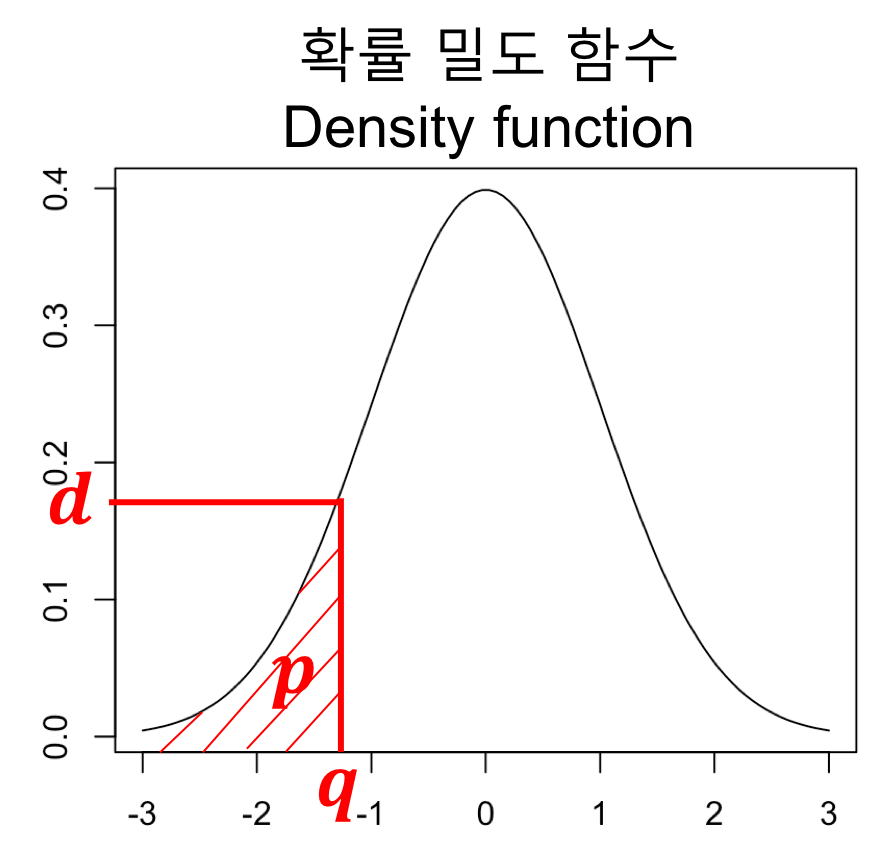
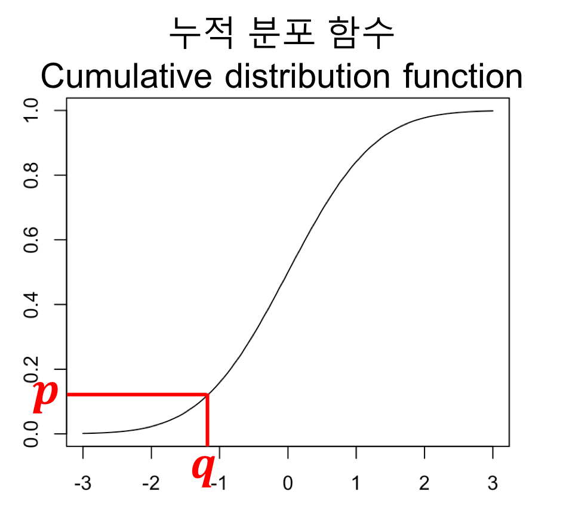

## Overview
- 복습
- 정규분포

## 복습
- WI 구할 때, 벡터 연산 이용하기
    - 순서
        - 월 평균 기온에서 5를 뺀 값들의 벡터 구하기
            - `T0 <- c(t1-5, t2-5, ..., t12-5)`
            - tn은 n월의 평균 기온을 의미
        - `T0`에서 0보다 큰 것들만 구하기
            - WI 식에서, t > 5인 t만 취급하기 때문
            - `T5 <- c(t3-5, t4-5, ..., t11-5)`
            - Boolean Indexing 사용
        - WI 구하기
            - `WI = sum(T5)`
            - `WI = t3 + t4 + ... + t11` 인데, 결국 `T5`의 원소를 모두 더한 것과 같음
    - 코드
        ```R
        cal_WI2 <- function(dirpath) {
            temp_prec_df <- mean_temp_prec(dirpath)
            T0 <- temp_prec_df$temp - 5
            
            T5 <- T0[T0 > 0]
            WI <- sum(T5)
            
            return(WI)
        }
        ```
        - 여기서 `mean_temp_prec(dirpath)` 함수는 [0705.md/Data Frame예제 1](https://github.com/haekyu/Jiyeon/blob/master/0705/0705.md)에 구현되어 있음.
- Coldest month 구할 때, which() 사용하기
    - `which()` 함수
        - **특정 조건**을 만족하는 원소의 **index**를 리턴한다.
        - ex) `v <- c(11, 12, 13, 14, 15)`가 있을 때, **짝수** 원소의 **index**를 얻어라!
            ```R
            > v <- c(11, 12, 13, 14, 15)
            > even_indices <- which(v %% 2 == 0)
            > even_indices
            [1] 2 4
            ```
    - Coldest month 구하기
        - `Temp <- c(t1, t2, ..., t12)`에서 
        - `Temp == min(Temp)` 의 조건을 만족시키는
        - index를 찾으면 됨! (index가 공교롭게 month랑 같음. index가 3이면 3월의 값임.)
    - 코드
        ```R
        find_cm<-function(dirpath){
            temp_prec_df <- mean_temp_prec(dirpath)
            minimum_t <- which(temp_prec_df$temp == min(temp_prec_df$temp))
            
            return(minimum_t)
        }
        ```
- PE ratio 구하기
    ```R
    cal_PE_ratio <- function(i, dirpath) {
        # monthly df
        monthly_df <- mean_temp_prec(dirpath)
        
        # Pi, Ti
        pi <- monthly_df$prec[i]
        ti <- monthly_df$temp[i]
        
        if (ti < -2) {
            ti <- -2
        }
        
        # PE ratio
        Tb <- ti + 12.2
        PE_Ratio <- 0.165 * (pi / Tb) ^ (10 / 9)
        if (PE_Ratio > 40) {
            PE_Ratio <- 40
        }
        
        return(PE_Ratio)
    }
    ```


## 정규분포
- 
- 
- `dnorm(q, mean=?, sd=?)` 함수
    - 확률 밀도 구하는 함수
        - 위 첫번째 그림에서 q에 해당하는 확률 밀도값 d가 리턴됨
        - mean에는 정규분포의 평균값을 주면 됨
        - sd에는 정규분포의 표준편차값을 주면 됨
    - d: density 의미. d + norm.
- `pnorm(q, mean=?, sd=?)` 함수
    - 확률을 구하는 함수
        - 위 그림에서 q에 대한 누적확률값 p가 리턴됨
        - mean에는 정규분포의 평균값을 주면 됨
        - sd에는 정규분포의 표준편차값을 주면 됨
    - p: probability 의미. p + norm.
- `qnorm(p, mean=?, sd=?)` 함수
    - 분위수 구하는 함수
        - 위 그림에서 확률 p에 대한 분위값 p가 리턴됨. 
        - 누적확률분포 함수의 역함수 격.
        - mean에는 정규분포의 평균값을 주면 됨
        - sd에는 정규분포의 표준편차값을 주면 됨
    - q: quantile..? (분위수) 의미. q + norm.


## 다음시간
- plot 추가
    - 