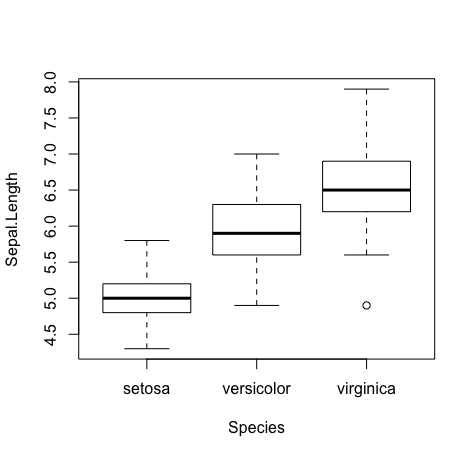
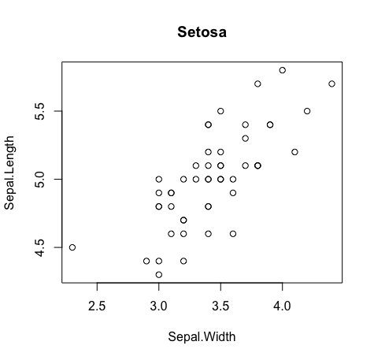
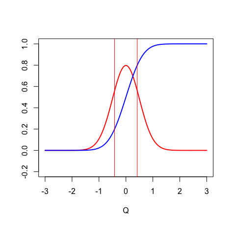

## Overview
- plot 함수 복습
- plot 겹쳐 그리기
- legend (범례)
- 한 팔레트에 plot 여러 개 그리기

## Plot 함수 복습
- `plot()` 함수는 가장 간단하게는 점/선 그래프를 그려준다.
- 물론 상황에 맞게 알아서 제일 예쁜 그래프를 그려준다. 
    - 예) 알아서 box plot을 그려주기도 한다.
        ```R
        plot(Sepal.Length~Species, data=iris)
        ```
         

- 기본형
    ```R
    plot(x, y                           # x벡터, y벡터 
         ,  type="l"/"p"/"b"/"n"        # 어떻게 그릴 것인지
         ,  lty="dotted"/"dashed"/0~5   # linetype
         ,  lwd=..                      # line 두께
         ,  xlim=c(from, to)            # x limit
         ,  ylim= ..                    # y limit
         ,  col='red'/...               # color
         ,  pch=0~25                    # marker(점) 종류
         ,  main="main title"           # main title
         ,  sub="sub title"             # sub title
         ,  xlab="..."                  # x label
         ,  ylab="..."                  # y label
         ,  cex.lab=1.5,                # label font size
         ,  cex.axis=1.5,               # 축 위의 숫자 font size
         ,  cex.main=1.5,               # main title font size
         ,  cex.sub=1.5)                # sub title font size
    ```
- Data Frame 이용형
    ```R
    plot(y~x,        # x에 대한 y를 그린다. 여기서 x와 y는 각각 컬럼이름.
         data=df,    # Data frame 준다
         ...)        # 나머지 옵션은 똑같이
    ```
    ex)
    ```R
    # iris에서 setosa에 대한 정보만 가져와서 setosa_df라는 데이터프레임으로 저장.
    setosa_df <- iris[iris$Species == 'setosa']

    # setosa_df를 이용하여 plot을 그린다.
    plot(Sepal.Length~Sepal.Width, data=setosa_df, main="Setosa")
    ```
     

## plot 겹쳐 그리기
- 순서
    - Empty plot 그리기
    - plot 추가하기
- Empty plot 그리기
    - `plot()` 함수의 type 옵션을 "n" 으로 준다. 아무것도 안그린다는 뜻.
    - 여기서 중요한 것은 xlim, ylim에 적절한 범위를 주는 등 적절한 크기와 범위의 empty plot을 그리는 것이다.
    - 예)
        ```R
        plot(?, ?, type="n", ?)
        ```
- plot 추가하기
    - `abline()` 함수: 단순한 직선 추가
        ```R
        abline(a = ?     # y = a + bx 형태의 직선을 그릴 때의 y절편값
               b = ?     # y = a + bx 형태의 직선을 그릴 때의 기울기값
               v = ?     # vertical line
               h = ?)    # horizontal line
        ```
        - [참고](https://thebook.io/006723/ch06/03/03/)
    - `points()` 함수: 점/선 그래프 추가
        - plot 함수랑 인풋 옵션 주는 방식이 똑같다.
    - 기타 등등 함수들은 구글에 검색!
- 예)
    ```R
    # Define mean and standard deviation
    m <- 0
    s <- 0.5

    # Draw an empty plot
    plot(0, 0, xlim=c(-3, 3), ylim=c(-0.2, 1), type='n', xlab='Q', ylab='')

    # Draw density function of normal distribution
    x_seq <- seq(-3, 3, length=100)
    points(x_seq, dnorm(x_seq, mean=m, sd=s), type='l', col='red', lwd=2)

    # Draw cumulative probability function of normal distribution
    points(x_seq, pnorm(x_seq, mean=m, sd=s), type='l', col='blue', lwd=2)

    # Draw 20% ~ 80% vertical line
    q_0.2 <- qnorm(0.2, mean=m, sd=s)
    q_0.8 <- qnorm(0.8, mean=m, sd=s)
    abline(v=c(q_0.2, q_0.8), col='red')
    ```
     

## Legend (범례)
- `legend()` 함수
    ```R
    legend(x,      # legend의 x 좌표. 
                   # 혹은 "bottomright", "bottom", 등으로 표현 가능.
                   # 혹은 locator(1) 이라는 옵션을 주고 마우스로 직접 위치 선택 가능.
           y=NULL, # legend의 y 좌표.
           legend, # 범례
           ...
          )
    ```
- [참고](https://thebook.io/006723/ch06/06/)

## 한 팔레트에 plot 여러 개 그리기
- 순서
    - 팔레트 구성
    - plot 그리기
- 팔레트 구성
    ```R
    par(mfrow=c(row개수, col개수))
    ```
- 이후 그냥 `plot()` 함수를 순서대로 사용하면 됨.

## 3d plot
- `scatterplot3d()` 함수 사용
- [참고](https://blog.naver.com/liberty264/221065056266)
- plot() 함수와 매우 비슷하게 사용하면 됨. 
- 단 (x, y, z) 세 개의 값을 넣어주어야 한다는 것이 다름.