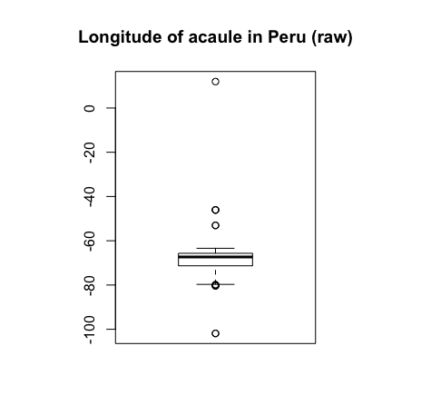

## Overview
- Data Frame 에서 Boolean Indexing 적용하기
- 수목 분포 데이터 가져오기
- 수목 분포 데이터 parsing하기

## Data Frame 에서 Boolean Indexing 적용하기
- 지난 시간 복습..겸?
- `df[boolean index, ]`
    - cf) `df[행, 렬]`
- `subset(df, 조건)`

## 수목 분포 데이터 가져오기
- 수목 분포 데이터는 [gbif (Global Biodiversity Inventory Facility)](https://www.gbif.org)에서 가져온다.
- `dismo` 패키지의 `gbif()`함수 사용.
    - `dismo` 는 Species Distribution Modeling 을 위한 패키지
    - `gbif()` 는 gbif의 데이터를 가져오는 함수
    - dismo 다운로드 / 사용
        ```R
        # Download dismo
        install.packages("dismo")

        # Import dismo
        library("dismo")
        ```
- gbif 함수
    - gbif에서 검색되는 수종의 데이터를 얻어 data.frame 형식으로 리턴해준다.
    - gbif 함수 형태
        ```R
        gbif(genus, species="", ... 기타 옵션 ...)
        ```
        - 기타 옵션은 `?gbif`를 통해 확인
    - 예) 소나무(Pinus densiflora) 의 데이터를 얻어 보자.
        ```R
        # Import dismo
        library("dismo")

        # Get pinus densiflora data
        pinus_densiflora <- gbif('Pinus', species='densiflora')

        # Print column names
        print(colnames(pinus_densiflora))

        # Print some parts of the data
        print(head(pinus_densiflora[, c('species', 'country', 'lat', 'lon')]))
        ```
        출력 결과
        ```
        [1] "ISO2"
        [2] "acceptedNameUsage"
        ...
        [16] "continent"
        ...
        [18] "country"
        ...
        [83] "lat"
        ...
        [88] "lon"
                   species country      lat      lon
        1 Pinus densiflora   Japan 35.25024 139.0797
        2 Pinus densiflora   Japan 35.28718 139.0659
        3 Pinus densiflora   Japan 35.01779 135.6694
        4 Pinus densiflora   Japan 36.57740 139.8845
        5 Pinus densiflora Belgium       NA       NA
        6 Pinus densiflora Belgium       NA       NA
        ```

## 수목 분포 데이터 parsing하기
- 데이터 parsing이란 기존 데이터를 내가 원하는 방식으로 가공하는 것을 말합니다.
- 우리가 하려고 하는 parsing 작업!
    - gbif 데이터에서 country, lat(latitude, 위도)과 lon(longitude, 경도) 컬럼만 추출하기
    - lat과 lon의 값이 있는 경우만 추출하기 (NA 제외하기)
    - lat과 lon의 부호가 이상한 경우 제대로 만들어주기
- gbif 데이터에서 lat과 lon컬럼 추출하기
    ```R
    library("dismo")

    # Get pinus densiflora data
    pinus_densiflora <- gbif('Pinus', species='densiflora')

    # Extract country, lat, lon columns
    densiflora_df <- pinus_densiflora[, c('country', 'lat', 'lon')]
    ```
- lat과 lon의 값이 있는 경우만 추출하기
    ```R
    valid_pinus_df <- densiflora_df[!is.na(densiflora_df$lat) & !is.na(densiflora_df$lon), ]

    # NA 걸러내기 전 data frame의 row 개수와 column 개수
    print(dim(densiflora_df))

    # NA 걸러낸 후 data frame의 row 개수와 column 개수
    print(dim(valid_densiflora_df))
    ```
    출력 결과
    ```
    4121  3
    607   3
    ```
    lat이나 lon중 NA가 있는 데이터를 빼버렸더니, 총 4121개의 수목데이터가 607개로 줄었다.
- lat과 lon의 부호가 이상한 경우 제대로 만들어주기
    - 가끔 gbif의 데이터에서 위도와 경도의 (-)부호가 빠진 경우가 있다고 한다.
    - 예) Peru에 서식하는 acaule의 경도
        ```R
        acaule <- gbif('Solanum', species='acaule')
        acaule <- acaule[, c('country', 'lat', 'lon')]
        acaule <- acaule[!is.na(acaule$lat) & !is.na(acaule$lon),]
        peru_lon <- acaule$lon
        boxplot(peru_lon)
        ```
         <br>
        페루의 위도/경도는 -9.189967/-75.015152 라고 한다...! 0보다 큰 경도는 무엇?


## 경도 위도 가져오기
- geocode(c('San Jose', 'San Jose, Mexico'))
- click()

## Data cleansing

## Data cleansing 확인하기

## 다음시간
- location + temperature
- 수종별 WI, ...

## 나중에는
- 수종별 기후적합도 (우리끼리 정의해보고..)
- maxent도 하면 좋을텐데?
