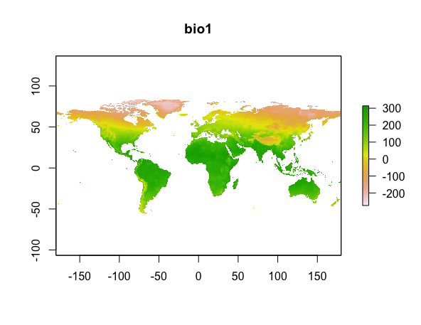

## 0. Overview
- Data Frame 추가
- 기후 변수 구하기
- Occurrence 데이터에 기후 변수 덧붙이기

## 1. Data Frame 추가
- Excel 파일 읽기
- Data Frame 저장하기
- Row, column 데이터 붙이기

### 1.1 Excel 파일 읽기
- `*.xls` 이나 `*.xlsx` 파일을 읽음
- `readxl` 패키지 사용
    ```R
    install.packages('readxl')
    library(readxl)
    ```
- `read_excel()` 함수 사용
    ```R
    read_excel(path, sheet=?, ...)
    ```
    - path: 파일경로를 넣어주면 됨
    - sheet: sheet 이름/번호 (없을 시 가장 첫 시트를 읽어옴)
- [참고](http://rfriend.tistory.com/313)

### 1.2 Data Frame 파일로 저장하기
- `write.csv()` 함수 사용
    ```R
    write.csv(x,              # 파일에 저장할 데이터 프레임 또는 행렬
              file="...",     # 데이터를 저장할 파일명
              row.names=TRUE  # TRUE면 행 이름을 CSV 파일에 포함하여 저장한다.
    )
    ```
- [참고](https://thebook.io/006723/ch04/02/01/)

### 1.3 Row, column 데이터 붙이기
- Row 붙이기
    - `rbid(df1, df2, df3, ...)` 함수 사용
        - df1, df2, df3, ... 을 행으로 붙인다.
        - 결과는 data.frame이다.
    - 예)
        ```R
        # setosa, virginica의 데이터 얻기
        setosa <- iris[iris$Species == 'setosa', ]
        virginica <- iris[iris$Species == 'virginica', ]

        # setosa와 virginica 데이터 붙이기
        row_merged <- rbind(setosa, virginica)

        print(row_merged)
        ```
        출력 결과
        ```
            Sepal.Length Sepal.Width Petal.Length Petal.Width   Species
        1            5.1         3.5          1.4         0.2    setosa
        2            4.9         3.0          1.4         0.2    setosa
        3            4.7         3.2          1.3         0.2    setosa
        ...
        148          6.5         3.0          5.2         2.0 virginica
        149          6.2         3.4          5.4         2.3 virginica
        150          5.9         3.0          5.1         1.8 virginica
        ```
- Column 붙이기
    - `df[열 이름] <- 열 벡터`
    - `cbind(vec1, vec2, vec3, ...)` 함수
        - vec1, vec2, vec3, ... 을 열로 붙임
        - array가 결과로 나옴
            - string 원소가 숫자로 변경됨. array이기 때문
            - data.frame를 얻고 싶으면 형변환을 하면 됨
    - 예)
        ```R
        species <- iris$Species
        sepal.length <- iris$Sepal.Length

        col_merged <- cbind(sepal.length, species)
        col_merged <- as.data.frame(col_merged)
        print(col_merged)
        ```
        출력 결과
        ```
            sepal.length species
        1            5.1       1
        2            4.9       1
        3            4.7       1
        ...
        ```
- [참고](https://thebook.io/006723/ch04/03/)

## 2. 기후 변수 구하기
- 2.1 전세계의 기후 데이터 얻기
- 2.2 원하는 위치의 데이터만 추출하기
- Species distribution modeling with R.pdf의 Ch 4. Environmental data 부분

### 2.1 전세계의 기후데이터 얻기
- WorldClim 데이터 얻기
    - `raster` 패키지
    - `getData()` 함수 사용
    - 1970-2000 년도의 데이터
- `getData()` 함수
    ```R
    getData(name,           # Dataset의 이름. 우리는 'worldclim' 사용
            download=T/F,   # 데이터를 다운로드 할 것인지. TRUE를 주면 됨.
            path='?',       # 데이터 저장 경로.
            var=?,          # 변수 종류. 'worldclim' 쓸 경우 필요.
            res=?,          # Resolution. 'worldclim' 쓸 경우 필요.
            country=?,      # ISO3 형식의 국가 이름. 'worldclim' 말고 다른 데이터셋 쓸 때 필요할 수도.
            ...)
    ```
    - name
        - Data set name
        - 'worldclim', 'GADM', 'countries', 'SRTM', 'alt' 중 하나 사용.
    - var
        - "tmean", "tmin", "tmax", "prec", "bio", "alt"
    - res
        - 0.5, 2.5, 5, 10 (minutes of a degree)
        - 0.5는 30초 (약 1 km<sup>2</sup>), 10은 10분 (약 340 km<sup>2</sup>) 의미.
        - res=0.5 이면, you must also provide a lon and lat argument for a tile
    - country
        - `getData('ISO3')` 나 `ccode()`로 ISO3 country code 알 수 있음.
    - `getData()` 의 output
        - RasterStack이 output임
        - cf) Raster data type
            - RasterLayer: 1종류 variable에 대한 raster data
            - RasterStack: 여러 종류 variables에 대한 raster data
- worldclim데이터의 bio 변수
    - [Bioclimatic variables 19개](http://www.worldclim.org/bioclim)
    - `getData()` 의 `var='bio'` 옵션을 주면 됨
    - 예)
        ```R
        # 전 세계의 worldclim 기후 변수 데이터 얻기
        # 결과는 19개의 layer가 쌓인 RasterStack이 됨.
        biodata <- getData('worldclim', var='bio', res=2.5)
        
        # bio raster 데이터 출력
        print(biodata)

        # bio1 만 plot 그림
        plot(biodata, 1)
        ```
        출력 결과
        ```
        class       : RasterStack 
        dimensions  : 3600, 8640, 31104000, 19  (nrow, ncol, ncell, nlayers)
        resolution  : 0.04166667, 0.04166667  (x, y)
        extent      : -180, 180, -60, 90  (xmin, xmax, ymin, ymax)
        coord. ref. : +proj=longlat +datum=WGS84 
        names       : bio1, bio2, bio3, bio4, bio5, bio6, bio7, bio8, bio9, bio10, bio11, bio12, bio13, bio14, bio15, ... 
        ```
        
    - cf) worldclim 데이터에서 var 옵션을 "tmean", "tmin", "tmax", "prec" 등으로 주면 월평균 기온, 월 최저기온, 월 최고기온, 월 강수량 등을 얻을 수 있다.
    - cf) `biovars()` in `dismo` 패키지
        - 강수량, 월최저기온, 월 최고기온 데이터가 있으면
        - bio 19개 데이터를 만들어준다고 함

### 2.2 원하는 위치의 데이터만 추출하기
- `extract()` 함수 사용
    ```R
    extract(x,  # Raster data
            y,  # 2-column 데이터 (ex, lon, lat 컬럼이 있는 분포데이터)
    )
    ```
- 예) treedb의 occurrence 데이터에 대한 기후 변수값 얻기
    ```R
    # treedb excel 파일에서 수종별 occurrence 데이터 읽기
    library(readxl)
    dirpath <- '/Users/haekyu/Downloads/Jiyeon/0724/data/'
    filepath <- paste(dirpath, 'treedb.xlsx', sep='')
    df <- read_excel(filepath, 2)

    # Worldclim 데이터셋으로부터 전세계의 기후변수 데이터 얻기
    library(raster)
    worldclim <- getData('worldclim', TRUE, var='bio', res=2.5)

    # treedb 데이터에 해당하는 위치의 기후변수값만 추출하기
    lon_lat_data <- df[, c(2: 3)]
    treedb_extract <- extract(worldclim, lon_lat_data)

    # treedb_extract를 raster에서 data.frame으로 형변환
    treedb_extract <- as.data.frame(treedbextract)

    # treedb_extract에서 NA값 있는 행은 싹 다 제외하기
    treedb_extract <- na.omit(treedb_extract)

    # treedb_extract 확인하기 (1:5 열만)
    print(treedb_extract[, 1:5])
    ```
    출력 결과
    ```
      bio1 bio2 bio3 bio4 bio5
    1  141   91   28 8127  296
    2  119  105   29 9158  291
    3  114   96   25 9998  293
    4  116   96   25 9961  294
    ...
    ```

## 3. Occurrence 데이터에 기후 변수 덧붙이기
- 위에서 우리가 한 것들을 종합하는 느낌!
- occurrence data (lon, lat) 와 각 위치의 기후변수값 (bio1, ..., bio19)를 붙임
- 예)
    ```R
    ##############################################################
    # 2.2 예제랑 똑같은 부분 (살짝 다름)
    ##############################################################

    # treedb excel 파일에서 수종별 occurrence 데이터 읽기 (2.2의 예제와 같음)
    library(readxl)
    dirpath <- '/Users/haekyu/Downloads/Jiyeon/0724/data/'
    filepath <- paste(dirpath, 'treedb.xlsx', sep='')
    occur_df <- read_excel(filepath, 2)

    # Worldclim 데이터셋으로부터 전세계의 기후변수 데이터 얻기 (2.2의 예제와 같음)
    library(raster)
    worldclim <- getData('worldclim', TRUE, var='bio', res=2.5)

    # treedb에 해당하는 기후변수 데이터 얻기 (2.2의 예제와 같음)
    treedb_extract <- extract(worldclim, occur_df[, c(2: 3)])
    treedb_extract <- as.data.frame(treedbextract)
    treedb_extract <- na.omit(treedb_extract)

    ##############################################################
    # 여기서부터가 OCCURRENCE와 BIO변수 붙이기!
    ##############################################################

    # 컬럼명을 위한 bio 어쩌고 스트링 벡터 얻기
    # 즉, c('bio1', 'bio2', ..., 'bio19') 를 얻고자 함
    # 저 벡터를 cols라는 변수에 넣을 것임
    cols <- c()
    for (n in 1:19) {
        col <- paste('bio', n, sep='')
        cols <- c(cols, col)
    }

    # 기존 occur_df에다 bio벡터들 붙이기
    occur_df[, cols] <- treedbextract[, ]

    # 결과 확인 (1:8 열만)
    print(head(occur_df[, 1:8]))
    ```
    출력 결과
    ```
    # A tibble: 6 x 8
      kind                  lon   lat  bio1  bio2  bio3  bio4  bio5
      <chr>               <dbl> <dbl> <dbl> <dbl> <dbl> <dbl> <dbl>
    1 Chionanthus retusus  129.  35.0   141    91    28  8127   296
    2 Chionanthus retusus  129.  35.8   119   105    29  9158   291
    3 Chionanthus retusus  127.  37.3   114    96    25  9998   293
    4 Chionanthus retusus  127.  37.3   116    96    25  9961   294
    5 Chionanthus retusus  129.  36.3   109   106    29  8994   279
    6 Chionanthus retusus  127.  34.4   137    77    25  7988   288
    ```


## 다음 시간
- Data frame 추가
    - na.omit(): 결측값이 들어있는 행 전체를 데이터 셋에서 제거
- Plot 추가
    - [지도 그리기](http://zbulletjournal.tistory.com/73)
    - Plot size 조절
- getData 추가
    - rcp 시나리오, 2050년, 2070년
- Species distribution data parsing 추가
    - 한 종의 데이터에서, 모든 지역에 대한 데이터 처리하기
    - 모든 수종의 데이터 만들기