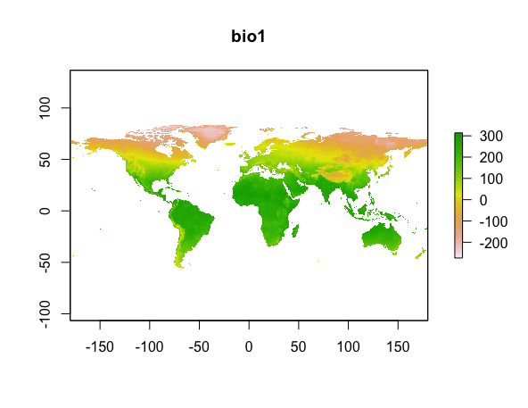

## Overview
- Data Frame 추가
    - Excel 파일 읽기
    - Data Frame 저장하기
    - Row, column 데이터 붙이기
- Species distribution data parsing 추가
    - 한 종의 데이터에서, 모든 지역에 대한 데이터 처리하기
    - 모든 수종의 데이터 만들기
- 기후 변수 구하기

## Data Frame 추가
- Excel 파일 읽기
    - `*.xls` 이나 `*.xlsx` 파일을 읽음
    - `readxl` 패키지 사용
        ```R
        install.packages('readxl')
        library(readxl)
        ```
    - `read_excel()` 함수 사용
        ```R
        read_excel(path, sheet=?, ...)
        ```
        - path: 파일경로를 넣어주면 됨
        - sheet: sheet 이름/번호 (없을 시 가장 첫 시트를 읽어옴)
    - [참고](http://rfriend.tistory.com/313)
- Data Frame 파일로 저장하기
    - `write.csv()` 함수 사용
        ```R
        write.csv(x,              # 파일에 저장할 데이터 프레임 또는 행렬
                  file="...",     # 데이터를 저장할 파일명
                  row.names=TRUE  # TRUE면 행 이름을 CSV 파일에 포함하여 저장한다.
        )
        ```
    - [참고](https://thebook.io/006723/ch04/02/01/)
- Row, column 데이터 붙이기
    - Row 붙이기
        - `rbid(df1, df2, df3, ...)` 함수 사용
            - df1, df2, df3, ... 을 행으로 붙인다.
            - 결과는 data.frame이다.
        - 예)
            ```R
            # setosa, virginica의 데이터 얻기
            setosa <- iris[iris$Species == 'setosa', ]
            virginica <- iris[iris$Species == 'virginica', ]

            # setosa와 virginica 데이터 붙이기
            row_merged <- rbind(setosa, virginica)

            print(row_merged)
            ```
            출력 결과
            ```
                Sepal.Length Sepal.Width Petal.Length Petal.Width   Species
            1            5.1         3.5          1.4         0.2    setosa
            2            4.9         3.0          1.4         0.2    setosa
            3            4.7         3.2          1.3         0.2    setosa
            ...
            148          6.5         3.0          5.2         2.0 virginica
            149          6.2         3.4          5.4         2.3 virginica
            150          5.9         3.0          5.1         1.8 virginica
            ```
    - Column 붙이기
        - `df[열 이름] <- 열 벡터`
        - `cbind(vec1, vec2, vec3, ...)` 함수
            - vec1, vec2, vec3, ... 을 열로 붙임
            - array가 결과로 나옴
                - string 원소가 숫자로 변경됨. array이기 때문
                - data.frame를 얻고 싶으면 형변환을 하면 됨
        - 예)
            ```R
            species <- iris$Species
            sepal.length <- iris$Sepal.Length

            col_merged <- cbind(sepal.length, species)
            col_merged <- as.data.frame(col_merged)
            print(col_merged)
            ```
            출력 결과
            ```
                sepal.length species
            1            5.1       1
            2            4.9       1
            3            4.7       1
            ...
            ```
    - [참고](https://thebook.io/006723/ch04/03/)

## Species distribution data parsing 추가
- 한 종의 데이터에서, 모든 지역에 대한 데이터 처리하기
- 모든 수종의 데이터 만들기

## 기후 변수 구하기
- Species distribution modeling with R.pdf의 Ch 4. Environmental data 부분
- 순서
    - 전세계의 기후 데이터 얻기
    - 원하는 위치의 데이터만 추출하기

### 전세계의 기후데이터 얻기
- WorldClim 데이터 얻기
    - `raster` 패키지
    - `getData()` 함수 사용
- `getData()` 함수
    ```R
    getData(name,           # Dataset의 이름. 우리는 'worldclim' 사용
            download=T/F,   # 데이터를 다운로드 할 것인지. TRUE를 주면 됨.
            path='?',       # 데이터 저장 경로.
            var=?,          # 변수 종류. 'worldclim' 쓸 경우 필요.
            res=?,          # Resolution. 'worldclim' 쓸 경우 필요.
            ...)
    ```
    - name
        - Data set name
        - 'worldclim', 'GADM', 'countries', 'SRTM', 'alt' 중 하나 사용.
    - var
        - "tmean", "tmin", "tmax", "prec", "bio", "alt"
    - res
        - 0.5, 2.5, 5, 10 (minutes of a degree)
        - 0.5는 30초 (약 1 km<sup>2</sup>), 10은 10분 (약 340 km<sup>2</sup>) 의미.
        - res=0.5 이면, you must also provide a lon and lat argument for a tile
    - `getData()` 의 output
        - RasterStack이 output임
        - cf) Raster data type
            - RasterLayer: 1종류 variable에 대한 raster data
            - RasterStack: 여러 종류 variables에 대한 raster data
- worldclim데이터의 bio 변수
    - [Bioclimatic variables 19개](http://www.worldclim.org/bioclim)
    - `getData()` 의 `var='bio'` 옵션을 주면 됨
    - 예)
        ```R
        # 전 세계의 worldclim 기후 변수 데이터 얻기
        biodata <- getData('worldclim', var='bio', res=2.5)
        
        # bio raster 데이터 출력
        print(biodata)

        # bio1 만 plot 그림
        plot(biodata, 1)
        ```
        출력 결과
        ```
        class       : RasterStack 
        dimensions  : 3600, 8640, 31104000, 19  (nrow, ncol, ncell, nlayers)
        resolution  : 0.04166667, 0.04166667  (x, y)
        extent      : -180, 180, -60, 90  (xmin, xmax, ymin, ymax)
        coord. ref. : +proj=longlat +datum=WGS84 
        names       : bio1, bio2, bio3, bio4, bio5, bio6, bio7, bio8, bio9, bio10, bio11, bio12, bio13, bio14, bio15, ... 
        ```
        


- WGS84: 세계 지구 좌표시스템

getData('ISO3'): country code
iso <- ccode()
iso[, c('NAME', 'ISO3')]

getData('worldclim', var=?, res=?)
- var
    - 'tmin', 'tmax', 'prec', 'bio'
    - 
- res
    

getData('CMIP5', var=?, res=?, rcp=?, model=?, year=?)
- (projected) future climate data
- res
    - 2.5, 5, 10
- rcp
    - 26, 45, 60, 85
- model
    - "AC", "BC", "CC", "CE", "CN", "GF", "GD", "GS", "HD", "HG", "HE", "IN", "IP", "MI", "MR", "MC", "MP", "MG", "NO"
- year
    - 50, 70


WorldClim version 2 has average monthly climate data for minimum, mean, and maximum temperature and for precipitation for 1970-2000.


biovars()
- 알아서 bio 데이터 만들어준다고 함

