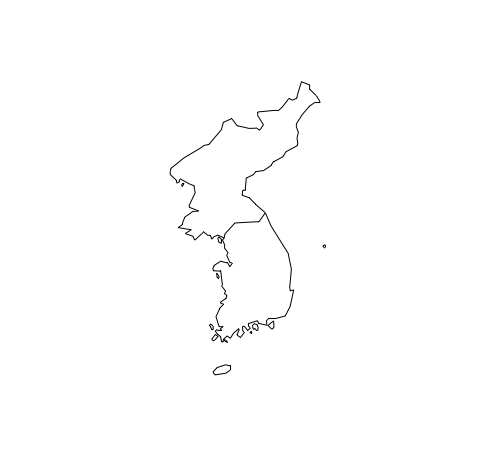

## 0. Overview
- Data frame 추가: na.omit()
- 지도 그리기
- bio 기후 변수 추가
    - getData rcp 시나리오
    - biovars()
- Species distribution data parsing 추가
    - 한 종의 데이터에서, 모든 지역에 대한 데이터 처리하기
    - 모든 수종의 데이터 만들기
- Git

## 1. Data Frame 추가: na.omit()
- `na.omit()` 함수
    - 결측값이 들어있는 행 전체를 데이터 셋에서 제거
    - `na.omit(df)`은 df에서 NA가 들어있는 행을 모조리 제거한 새로운 data frame을 리턴한다.
- 예) occurrence 데이터에서, lon과 lat이 NA가 아닌 것들만 얻고 싶을 때
    ```R
    # 이렇게 해도 되고
    valid_pinus_df <- densiflora_df[!is.na(densiflora_df$lat) & !is.na(densiflora_df$lon), ]

    # 이렇게 해도 된다. 단, 여기서 열은 lon과 lat뿐일 때만 위 버전이랑 같다.
    # 다른 열이 끼어있고 (예를들어 국가), 그 열의 값중에 NA가 들어있으면 
    # 그 NA때문에 lon과 lat이 정상이더라도 해당 행이 통째로 날라갈 수도 있다.
    valid_pinus_df <- na.omit(densiflora_df)
    ```

## 2. 지도 그리기
- 패키지
    - maps 패키지 이용
        - `world` dataset 이용
        - `library(maps)`
    - mapdata 패키지 이용
        - `worldHires` dataset 이용
        - `world` dataset보다 해상도가 좋음
        - `library(mapdata)`
- `map()`함수
    - maps, mapdata 패키지 모두 map() 함수를 사용한다.
    - 함수 input
        ```R
        map(database= ?,      # dataset 이름. 'world'나 'worldHires' 주면 됨
            regions = ?,      # 지역 이름.
            ...)
        ```
    - 예)
        ```R
        library(maps)
        map(database='world', regions=c('South Korea', 'North Korea'))
        ```
        출력 결과<br>
        

## 3. bio 기후 변수 추가
- getData rcp 시나리오
- `biovars()`: bio 변수 값들 구하기

## 3.1 getData() rcp 시나리오
- rcp 시나리오에 의한 미래 기후 데이터 얻음
- rgdal 패키지 필요
    ```R
    library(rgdal)
    ```
- `getData()` 함수 사용
    ```R
    getData('CMIP5',      # name 인풋은 'CMIP5' 로 준다.
            var=?,        # 'bio', 'tmean', tmin', 'tmax', 'prec' 가능
            res=?,        # resolution. 2.5, 5, 10 가능
            rcp=?,        # 26, 45, 60, 85 가능. (예: 85는 rcp8.5를 의미)
            model=?,      # model 이름. 아래 가능한 옵션 적어둠 (cf1)
            year=?        # 50, 70 가능
    )
    ```
    - cf1) 'model' 옵션은 "AC", "BC", "CC", "CE", "CN", "GF", "GD", "GS", "HD", "HG", "HE", "IN", "IP", "MI", "MR", "MC", "MP", "MG", "NO" 중 하나가 가능.
    - cf2) 위 모델을은 각각 무엇을 의미하는지는 모르겠음....

## 3.2 biovars()
- 월별 기후데이터로 bio 변수 값을 얻어내는 함수
- dismo package 필요
    ```R
    library(dismo)
    ```
- `biovars()` 함수
    ```R
    biovars(prec,       # 월별 (평균?) 강수량 벡터
            tmin,       # 월별 최저기온 벡터
            tmax,       # 월별 최고기온 벡터
            ...
    )
    ```
- 예)
    ```R
    ###########################################
    # 2017년도의 월별 강수량/최저기온/최고기온 구하기
    ###########################################

    # Input directory
    dirname <- '/Users/haekyu/Downloads/Jiyeon/0703/2017-temp-prec/utf8/'

    # 월별 강수량 / 최저기온 / 최고기온 벡터 초기화
    prec <- c()
    tmin <- c()
    tmax <- c()
    
    # 2017년도의 prec, tmin, tmax 구하기
    for (month in 1:12) {
        # 해당 month의 데이터 읽기
        filename <- paste(dirname, sprintf('2017_%02d_utf8.csv', month), sep='')
        df <- read.csv(filename, header=T, sep=',')

        # 해당 month의 평균 강수량, 최저기온, 최고기온 구하기
        mean_pre <- mean(df$Prec, na.rm=T)
        min_temp <- min(df$Temp, na.rm=T)
        max_temp <- max(df$Temp, na.rm=T)
        
        # 해당 month 값을 tmin, tmax, prec 벡터에 덧붙이기
        tmin <- c(tmin, min_temp)
        tmax <- c(tmax, max_temp)
        prec <- c(prec, mean_pre)
    }

    ###########################################
    # biovars() 로 bio 변수 값 구하기
    ###########################################
    library(dismo)

    # bio 변수 값 구하기
    bio_2017 <- biovars(prec, tmin, tmax)

    # 5개 열만 출력
    print(bio_2017[, 1:5])
    ```
    출력 결과
    ```
        bio1       bio2       bio3       bio4       bio5 
    13.50000   21.35000   44.85294 1079.85689   35.00000
    ```

## 4. Species distribution data parsing 추가

## 4.1 한 종의 데이터에서, 모든 지역에 대한 데이터 처리하기
- [0717.md](https://github.com/haekyu/Jiyeon/blob/master/0717/0717.md) 에서는 Peru에 대해서만 처리했었음.
- 여기서는 0717.md를 확장하여 모든 지역에 대한 데이터를 처리함.
- 예) acaule
    ```R
    # Acaule 데이터 얻기
    acaule <- gbif('solanum', species='acaule')
    acaule <- acaule[, c('country', 'lon', 'lat')]
    
    # Acaule 데이터에서 NA 제거
    acaule <-na.omit(acaule)
    
    # Acaule 가 존재하는 국가들 얻기
    countryname <- unique(acaule$country)
    
    # 위 국가들의 geocode 얻기
    geoco <- geocode(countryname)
    geoco <- geoco[, c(1, 5:8)]
    
    # Empty data.frame 만들기. 
    # 이 data.frame에는 위치 정보가 적절한 모든 occurrence data를 모을 예정
    acaule_total <- data.frame()
    
    # 각 나라당 lon, lat 범위가 적절한 것들만 살려냄
    for (c in countryname) {
        c_xmin <- geoco[geoco$originalPlace==c,]$xmin
        c_xmax <- geoco[geoco$originalPlace==c,]$xmax
        c_ymin <- geoco[geoco$originalPlace==c,]$ymin
        c_ymax <- geoco[geoco$originalPlace==c,]$ymax
        
        boundary <- acaule[(acaule$country == c) & (c_xmin < acaule$lon), ]
        boundary <- boundary[(boundary$country == c) & (c_xmax > boundary$lon), ]
        boundary <- boundary[(boundary$country == c) & (c_ymin < boundary$lat), ]
        boundary <- boundary[(boundary$country == c) & (c_ymax > boundary$lat), ]
        
        # acaule_total에 적절한 것드로 살아남은 애들을 저장함
        acaule_total <- rbind(acaule_total, boundary)
    }
    ```

### 4.2 모든 종에 대해 처리하기
- 모든 종에 대한 data 저장하기
    ```R
    library(readxl)
    dirpath <- '/Users/haekyu/Downloads/Jiyeon/0724/data/'
    treedb <- read_excel(paste(dirpath, 'treedb.xlsx', sep=''), sheet = 3)
    tree_names <- treedb$scientific_name

    for (tree in tree_names) {
        tree_name <- strsplit(tree, split=" ")[[1]]
        genus <- tree_name[1]
        species <- tree_name[2]
        
        treedf <- gbif(genus, species=species)
        treedf <- treedf[, c('country', 'lon', 'lat')]
        treedf <- na.omit(treedf)
        
        filepath <- paste(dirpath, sprintf('%s.csv', tree_name), sep='')
        write.csv(treedf, filepath)
    }
    ```
- 모든 종에 대한 data를 얻어 처리하기
    ```R
    library(readxl)
    dirpath <- '/Users/haekyu/Downloads/Jiyeon/0724/data/'
    treedb <- read_excel(paste(dirpath, 'treedb.xlsx', sep=''), sheet = 3)
    tree_names <- treedb$scientific_name

    # 모든 종에 대한 data.frame 얻기
    all_tree_df <- data.frame()
    for (tree in tree_names) {
        tree_name <- strsplit(tree, split=" ")[[1]]
        genus <- tree_name[1]
        species <- tree_name[2]
        filepath <- paste(dirpath, sprintf('%s.csv', tree_name), sep='')

        treedf <- read.csv(filepath)

        # tree가 존재하는 국가들 얻기
        countryname <- unique(treedf$country)

        # 위 국가들의 geocode 얻기
        geoco <- geocode(countryname)
        geoco <- geoco[, c(1,5:8)]

        # Empty data.frame 만들기. 
        # 이 data.frame에는 위치 정보가 적절한 모든 occurrence data를 모을 예정
        tree_valid <- data.frame()

        # 각 나라당 lon, lat 범위가 적절한 것들만 살려냄
        for (c in countryname) {
            c_xmin <- geoco[geoco$originalPlace==c,]$xmin
            c_xmax <- geoco[geoco$originalPlace==c,]$xmax
            c_ymin <- geoco[geoco$originalPlace==c,]$ymin
            c_ymax <- geoco[geoco$originalPlace==c,]$ymax
            
            boundary <- acaule[(acaule$country == c) & (c_xmin < acaule$lon), ]
            boundary <- boundary[(boundary$country == c) & (c_xmax > boundary$lon), ]
            boundary <- boundary[(boundary$country == c) & (c_ymin < boundary$lat), ]
            boundary <- boundary[(boundary$country == c) & (c_ymax > boundary$lat), ]
            
            # acaule_total에 적절한 것드로 살아남은 애들을 저장함
            tree_valid <- rbind(tree_valid, boundary)
        }

        all_tree_df <- rbind(all_tree_df, tree_valid)
    }

    # all_tree_df 가 완료된 버전!
    ```

## 5. Git
### 5.1 Git
+ Why Git?
    - 코드의 version 관리
        - 매 수정마다 screenshot(commit) 을 남김
    - 협업 용이
        - 여러 사람들의 수정이 동시에 반영이 가능
        - 다른 사람들이 어떻게 수정했는지 볼 수 있음
+ 다운로드
    - Windows 용: https://git-scm.com/download/win 에서 다운로드
    - 설치 후 Git bash 가 잘 실행되는지 체크
+ 용어
    - Local
        - 내 컴퓨터
        - client 느낌. Git server와 통신(?) 하는 내 컴퓨터
    - Repository
        - server 느낌. Git server의 코드 저장소
    - Clone
        - Git server의 repository 를 local로 복사해오는 행위
    - Commit
        - Git 에서의 screenshot
    - Push
        - Local 에서 Git repository로 정보를 전달하는 행위
    - Pull 
        - Git repository의 정보를 Local로 가져오는 행위 
+ 간단한 사용방법
    - local과 repository를 연동시키기
        - `git clone 레포지토리주소`
            - 레포지토리 주소는 각 레포지토리 홈화면에서 Clone or download 버튼을 누르면 나옴.
    - 파일 추가
        - add
            - `git add 추가할 파일 이름`
            - git add . 하면 모든 수정된 파일이 add 됨.
        - commit
            - `git commit -m "commit 메세지"`
        - push
            - `git push`
    - 파일 받아오기
        - `git pull`

### 5.2 Linux command
- clear
    - 화면 정리.
- ls
    - list의 줄임말. 현재 위치의 file list를 보여줌.
    - 옵션
        - ls -a
            - list all. 숨김파일까지 보여줌
        - ls -l
            - 만들어진 날짜 / 파일 크기 등 기타 정보도 보여줌. 
        - ls -t
            - 시간순 배열
        - ls -alt 등으로 여러 옵션을 한꺼번에 줄 수 있다.
- cd
    - change directory. 내가 원하는 디렉토리로 이동
    - cd 내가_이동하고_싶은_디렉토리_경로
        - ex) cd ~/Desktop 하면 바탕화면으로 이동
    - cf) ~ 은 홈 화면을 의미. 윈도우에서는 C:/Users/내 이름/ 이었던듯.
- mkdir
    - make directory. 디렉토리 생성
    - mkdir 원하는_디렉토리_이름
- cp 
    - copy. 파일 복사
    - cp from to
        - ex) cp love.txt ../love2.txt 하면 현재 디렉토리의 love.txt를 상위 폴더의 love2.txt로 복사
    - 옵션
        - cp -r from to
            - 디렉토리 복사.
            - 디렉토리를 복사하고싶으면 반드시 -r 옵션을 줘야 함.
- mv 
    - move. 파일/디렉토리 이동 
    - move from to
- rm
    - remove
    - rm 파일이름
    - 옵션
        - rm -r 디렉토리
            - 디렉토리 제거
        - rm -i 파일
            - 파일 삭제하기 전에 정말 삭제할 거냐고 yes or no 물어봄.
            - 나중에 alias를 통해 rm 을 하면 항상 rm -i가 실행되게끔 만들어 놓으면 편함.

### 5.3 Shell
- Linux 느낌의 까만 화면! (그러한 프로세스)
- bash 설정 등등
    - `~/.bash_profile` 에서 설정
    - `source ~/.bash_profile` 로 설정한 것들 컴퓨터에 적용
    - 구글에 bash_profile 환경 설정 검색하면 예쁜 설정 많음


