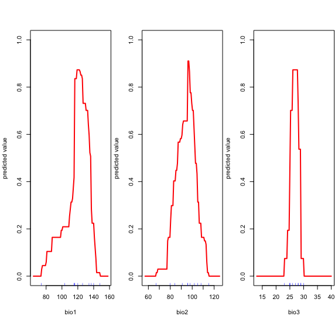

## 0. Overview
- Species Distribution Modeling (SDM)
    - Model?
    - Model fitting?
    - Model prediction?
    - Model evaluation?
- Bioclim
    - Bioclim 모델 만들기
    - Bioclim 모델로 변수값 예측하기
- Maxent
    - Maxent 구동 환경 구축하기
    - Maxent 모델 만들기

## 1. Species Distribution Modeling (SDM)
### 1.1 Model?
- Model 이란, 어떠한 numerical tool을 말한다. 
- 그 tool은 어떠한 변수들에 대한 관찰(input) 데이터를 가지고, 그 변수들의 예측값(output)을 만들어낼 수 있는 것들을 말한다.
- 우리가 다루는 Species distribution model들은 환경 변수들에 대한 species occurrence 관찰 데이터를 가지고, 그 환경 변수들의 예측값을 만들어낼 수 있는 모델들이다. 이번 시간에는 많은 모델들 중 `Bioclim`과 `MaxEnt`를 실행해 본다.

### 1.2 Model fitting?
- Model fitting이란 관찰 데이터에 가장 잘 맞는(fit) 모델을 만드는 과정을 말한다.
- 각 모델마다 fitting하는 방식은 다양하나, 큰 컨셉을 얘기해보자면 모델을 구성하고 있는 파라미터를 가장 좋은 것으로 튜닝하는 작업으로 말할 수 있을 것 같다.

### 1.3 Model prediction?
- Fitting된 모델로 원하는 변수의 예측값을 얻어내는 것이다.

### 1.4 Model evaluation?
- Model이 예측을 잘 하는지 평가하는 것을 말한다.
- 원하는 task마다 model을 평가하기 위한 index가 보통 존재한다. 이 index값이 model 평가 점수 결과라고 보면 된다.
    - 낮을 수록 좋은 model을 의미하는 index도 있고, 높을 수록 좋은 model을 의미하는 index도 있다.
- cf) Training / Test set

## 2. Bioclim
### 2.1 Bioclim 모델 만들기
- Species distribution modeling with R.pdf 의 chapter 5
- `dismo` 패키지의 `bioclim()` 사용
- `bioclim()`
    - 주어진 환경변수와 관찰 데이터를 받아서
    - 잘(?) fitting된 bioclim 모델을 만든다
    ```R
    bioclim(x,   # bio climate 데이터
            p,   # lon, lat 두개 열이 순서대로 이루어진 occurrence 위치 데이터 (없어도 돌아감)
            ...
    )
    ```
- 예) 한국에 있는 이팝나무의 데이터로 fitting시킨 bioclim 모델을 만들어 보자.
    - 1\) Data 준비. 0724.md의 2.2예제랑 비슷.
        ```R
        # Get Worldclim bio data
        library(raster)
        worldclim <- getData('worldclim', download=TRUE, var='bio', res=10)

        # Read occurrence data of Chionanthus retusus in Korea
        library(readxl)
        dirpath <- '/Users/haekyu/Downloads/Jiyeon/0724/data/'
        filepath <- paste(dirpath, 'treedb.xlsx', sep='')
        df <- read_excel(filepath, 2)
        retusus_df <- df[df$kind == 'Chionanthus retusus',]

        # Get bio climate variable of Chionanthus retusus
        retusus_lon_lat <- cbind(retusus_df[,'lon'], retusus_df[,'lat'])
        retusus_bio <- extract(worldclim, retusus_lon_lat)
        retusus_bio <- na.omit(retusus_bio)
        retusus_bio <- as.data.frame(retusus_bio)

        # Print results
        print('------- retusus_df -------------------------')
        print(head(retusus_df))
        print('')
        print('------- retusus_bio (1:3 column only) ------')
        print(head(retusus_bio[,1:3]))
        ```
        출력 결과
        ```
        [1] "------- retusus_df -------------------------"
        # A tibble: 6 x 3
          kind                  lat   lon
          <chr>               <dbl> <dbl>
        1 Chionanthus retusus  35.0  129.
        2 Chionanthus retusus  35.8  129.
        3 Chionanthus retusus  37.3  127.
        4 Chionanthus retusus  37.3  127.
        5 Chionanthus retusus  36.3  129.
        6 Chionanthus retusus  34.4  127.

        [1] "------- retusus_bio (1:3 column only) ------"
          bio1 bio2 bio3
        1  141   91   28
        2  119  105   29
        3  114   96   25
        4  116   96   25
        5  109  106   29
        6  137   77   25
        ```
    - 2\) 위에서 구한 이팝나무 bio 데이터로 fitting시킨 bioclim 모델 만들기. 
        - bio 변수는 1,2,3 만 사용한다고 가정
        ```R
        bc_model <- bioclim(retusus_bio[,c('bio1', 'bio2', 'bio3')])
        ```

### 2.2 Bioclim 모델로 변수값 예측하기
- Species distribution modeling with R.pdf 의 chapter 6
- `dismo` 패키지의 `predict()` 함수 사용
- `predict()` 함수
    - fitting된 모델과 
    - bio 변수 데이터를 넣어주면
    - bioclim 모델의 예측값이 나온다. (예측값...?)
    ```R
    predict(object,     # fitting된 모델. 
            x,          # 변수 데이터. data.frame 등을 넣어줄 수 있음.
            ...
    )
    ```
    - 예)
        - 1\) test data 만들기
            ```R
            # Make test data
            bio1 <- c(138, 137, 142)
            bio2 <- c(87, 77, 83)
            bio3 <- c(27, 25, 27)
            test = data.frame(cbind(bio1, bio2, bio3))
            ```
        - 2\) test data에 대한 예측값 만들기
            ```R
            prediction <- predict(bc_model, test)
            print(prediction)
            ```
            출력 결과
            ```
            [1] 0.25373134 0.08955224 0.09701493
            ```
        - 3\) bc_model 의 전반적인 행동 보기
            ```R
            response(bc_model)
            ```
            

### 2.3 예제
- 목표
    - 한국의 이팝나무 (과거? / rcp 시나리오) 데이터로 fitting 시킨 bioclim 모델을 만들고
    - 그 모델로 일본의 어느 위치 (일본 중앙 위치)에 이팝나무가 존재할 확률을 예측하기
- 예1) 한국 occurrence 데이터로 fitting 시킨 bioclim 모델로 이팝나무(Chionanthus retusus)가 일본의 어느 곳에 살만한지 예측해보기
    ```R
    ################################################################
    # 한국 데이터 준비
    ################################################################
    # worldclim 데이터 얻기
    library(dismo)
    climraster <- getData('worldclim', download = TRUE, var='bio', res=10)

    # 아팝나무 occurrence 데이터 얻기
    library(readxl)
    dirpath <- '/Users/haekyu/Downloads/Jiyeon/0724/data/'
    tree_db <- read_excel(paste(dirpath, 'treedb.xlsx', sep=''), sheet = 2)
    retusus_db <- tree_db[tree_db$kind == 'Chionanthus retusus',]

    # 이팝나무 각 위치의 bio 데이터 얻기
    retusus_bio <- extract(climraster, retusus_db[,c(3, 2)])
    

    ################################################################
    # bioclim 모델 피팅시키기
    ################################################################
    bioclim_model <- bioclim(retusus_bio[, 1:3])


    ################################################################
    # 일본의 중심 위치 얻기, 일본 중심 위치의 bio 데이터 얻기 
    ################################################################
    # 일본의 중심 위치 얻기
    japanextent <- geocode('japan')
    japanextent <- japanextent[, 3:4]

    # 일본 중심 위치의 bio 데이터 얻기 
    japandf <- extract(climraster, japanextent)
    japan_bio <- as.data.frame(japandf)[1: 3]


    ################################################################
    # 일본 중심 위치에 이팝나무가 존재할 확률 예측하기
    ################################################################
    p <- predict(bioclim_model, x=japan_bio)

    print(p)

    ```
    출력 결과
    ```
    [1] 0.3406721
    ```
- 예2) rcp 시나리오 상, 한국 데이터로 fitting 시킨 bioclim 모델로 이팝나무가 일본 중심 위치에서 존재할 확률 구하기
    ```R
    ################################################################
    # 한국 데이터 준비
    ################################################################
    # rcp 시나리오 데이터 얻기
    library(dismo)
    rcpraster <- getData('CMIP5', download = TRUE, var='bio', res=10, rcp=85, year=70, model='AC')

    # 아팝나무 occurrence 데이터 얻기
    library(readxl)
    dirpath <- '/Users/haekyu/Downloads/Jiyeon/0724/data/'
    tree_db <- read_excel(paste(dirpath, 'treedb.xlsx', sep=''), sheet = 2)
    retusus_db <- tree_db[tree_db$kind == 'Chionanthus retusus',]

    # 이팝나무 각 위치의 bio 데이터 얻기
    rcp_retusus_bio <- extract(rcpraster, retusus_db[,c(3, 2)])


    ################################################################
    # bioclim 모델 피팅시키기
    ################################################################
    rcp_bioclim_model <- bioclim(rcp_retusus_bio[, 1:3])

    japanextent<-geocode('japan')
    japanextent<-japanextent[,3:4]

    ################################################################
    # 일본의 중심 위치 얻기, 일본 중심 위치의 bio 데이터 얻기 
    ################################################################
    # 일본의 중심 위치 얻기
    japanextent <- geocode('japan')
    japanextent <- japanextent[, 3:4]

    # 일본 중심 위치의 bio 데이터 얻기 
    japandf <- extract(rcpraster, japanextent)
    japan_bio <- as.data.frame(japandf)[1: 3]

    ################################################################
    # 일본 중심 위치에 이팝나무가 존재할 확률 예측하기
    ################################################################
    rcp_p <- predict(rcp_bioclim_model, x=japan_bio)

    print(rcp_p)
    ```
    출력 결과
    ```
    [1] 0.04285714
    ```

## 3. Maxent 알고리즘
- Maxent 구동 환경 구축하기
- Maxent 모델 만들기
- cf) Species distribution modeling with R.pdf의 chapter 11.1 에 있음

### 3.1 Maxent 구동 환경 구축하기
- Maxent 프로그램 다운로드 받기
    - [Maxent Link](http://biodiversityinformatics.amnh.org/open_source/maxent/)에서 maxent 프로그램 다운로드
    - `maxent.jar` 파일이 있는지 확인
- `maxent.jar` 파일을 dismo 패키지 내 java폴더 안에 넣기
    - `system.file("java", package="dismo")` 을 실행시키면 dismo 패키지 내 java 폴더가 위치한경로를 알아낼 수 있다.
        - 예)
        ```R
        > system.file("java", package="dismo")
        [1] "/Library/Frameworks/R.framework/Versions/3.5/Resources/library/dismo/java"
        ```
    - 위 java 폴더 안에 `maxent.jar` 파일을 넣는다.
        - 예) Shell 에서 이동시켜도 됨. (물론 아래처럼 하지 않고 폴더 찾아서 마우스로 드래그 앤 드롭 / 파일 복사 해도 됩니다.)
        ```R
        # dismo 패키지의 java 폴더로 이동
        # cf) 위에서 나온 경로를 그대로 복사 붙여넣기 했습니다.
        cd "/Library/Frameworks/R.framework/Versions/3.5/Resources/library/dismo/java"

        # 다운받은 maxent.jar 파일을 현재 위치(java 폴더)에 복사.
        # cf) 제 컴퓨터에서는 maxent.jar이 ~/Downloads/maxent/maxent.jar 에 위치해있습니다. 
        # cf) maxent.jar의 경로는 다를 수 있습니다.
        cp ~/Downloads/maxent/maxent.jar .
        ```
- 잘 다운받아졌는지 확인
    - 아래 코드를 그대로 돌려보면 됨.
    ```R
    jar <- paste(system.file(package="dismo"), "/java/maxent.jar", sep='')
    if (file.exists(jar)) {
        print('maxent exists')
    } else {
        print('maxent does\'t exist')
    }
    ```
- rJava 라이브러리 다운로드
    ```R
    install.packages('rJava')
    library(rJava)
    ```
    - cf) 만약 library(rJava)를 실행했는데 아래처럼 오류가 났다면...
        ```
        Error: package or namespace load failed for 'rJava':
         .onLoad failed in loadNamespace() for 'rJava', details:
          call: dyn.load(file, DLLpath = DLLpath, ...)
          error: unable to load shared object '/Library/Frameworks/R.framework/Versions/3.5/Resources/library/rJava/libs/rJava.so':
          dlopen(/Library/Frameworks/R.framework/Versions/3.5/Resources/library/rJava/libs/rJava.so, 6): Library not loaded: /Library/Java/JavaVirtualMachines/jdk-9.jdk/Contents/Home/lib/server/libjvm.dylib
          Referenced from: /Library/Frameworks/R.framework/Versions/3.5/Resources/library/rJava/libs/rJava.so
          Reason: image not found
        ```
        - (git) bash를 켜시고 `sudo ln -f -s $(/usr/libexec/java_home)/jre/lib/server/libjvm.dylib /usr/local/lib` 를 실행해 주세요.
        - [참고](http://01s2-min.tistory.com/21)

### 3.2 Maxent 모델 만들기
- `dismo` 패키지의 `maxent()` 사용
- `maxent()`
    ```R
    maxent(x,      # raster 데이터
           p,      # lon, lat 순서의 2-column occurrence 데이터
           ...
    )
    ```
- 예) 이팝나무 데이터로 fitting시킨 maxent 모델 만들기
    ```R
    mx <- maxent(worldclim, retusus_lon_lat)
    ```

### 3.3 Maxent 모델로 예측하기
- `predict()` 함수 사용

### 3.4 maxent 예제
- 순서
    - 1\) 한국 이팝나무 데이터로 maxent 모델 fitting 시키기
    - 2\) 일본의 중앙 위치에 이팝나무가 존재할 확률을 예측하기
- 1\) 한국 이팝나무(Chionanthus retusus) 데이터로 maxent 모델 fitting 시키기
    ```R
    ################################################################
    # 한국 데이터 준비
    ################################################################
    # worldclim 데이터 얻기
    library(dismo)
    climraster <- getData('worldclim', download = TRUE, var='bio', res=10)

    # 아팝나무 occurrence 데이터 얻기
    library(readxl)
    dirpath <- '/Users/haekyu/Downloads/Jiyeon/0724/data/'
    tree_db <- read_excel(paste(dirpath, 'treedb.xlsx', sep=''), sheet = 2)
    retusus_db <- tree_db[tree_db$kind == 'Chionanthus retusus',]
    retusus_lon_lat <- as.data.frame(retusus_db[,c(3, 2)])

    # 이팝나무 각 위치의 bio 데이터 얻기
    retusus_bio <- extract(climraster, retusus_lon_lat)
    retusus_bio <- as.data.frame(retusus_bio)


    ##############################################################
    # maxent 모델 fitting 시키기
    ##############################################################
    # fitting 시키기
    library('rJava')

    # climraster[[1:3]] 은 layer 1:3 만 가져온다는 이야기.
    # 즉 bio1, bio2, bio3만 사용한다는 뜻
    mx <- maxent(climraster[[1:3]], retusus_lon_lat)

    # mx 모델 확인하기
    print(mx)
    ```
    출력 결과
    ```
    class    : MaxEnt 
    variables: bio1 bio2 bio3
    ```
    위 출력과 함께 다음과 같은 [html 페이지](http://htmlpreview.github.io/?https://github.com/haekyu/Jiyeon/blob/master/0731/maxent_retusus_123.html)가 뜬다.

- 2\) 일본의 중앙 위치에 이팝나무가 존재할 확률을 예측하기
    ```R
    ################################################################
    # 일본의 중심 위치 얻기, 일본 중심 위치의 bio 데이터 얻기 
    ################################################################
    # 일본의 중심 위치 얻기
    japanextent <- geocode('japan')
    japanextent <- japanextent[, 3:4]

    # 일본 중심 위치의 bio 데이터 얻기 
    japandf <- extract(climraster, japanextent)
    japan_bio <- as.data.frame(japandf)[1:3]


    ################################################################
    # 일본 중심 위치에 이팝나무가 존재할 확률 예측하기
    ################################################################
    p <- predict(mx, x=japan_bio)

    print(p)
    ```
    출력 결과
    ```
    [1] 0.376209
    ```
